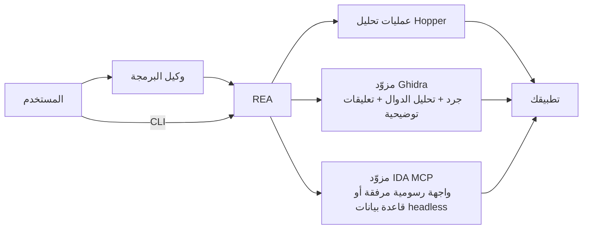

<div align="center">

[English](README.md) · [简体中文](README_zh.md) · [日本語](README_ja.md) · [한국어](README_ko.md) · **العربية**

# REA: اعكس هندسة أي شيء

### خادم MCP واحد للهندسة العكسية يشمل الملفات التنفيذية والتطبيقات وسلوك وقت التشغيل.

**رأيت ميزة تعجبك؟ افهم آلية عملها حتى مستوى الملف التنفيذي.**

[](https://www.npmjs.com/package/rea-agents)
[](https://github.com/morluto/rea/actions/workflows/ci.yml)
[](#منصة-أدوات-التحقيق)
[](https://nodejs.org/)
[](LICENSE)
[](https://discord.gg/GkcryMnJDM)

<a href="https://trendshift.io/repositories/82054?utm_source=repository-badge&amp;utm_medium=badge&amp;utm_campaign=badge-repository-82054" target="_blank" rel="noopener noreferrer"></a>

**[الموقع (بالإنجليزية)](https://morluto.github.io/rea/) · [أدلة الاستخدام](https://morluto.github.io/rea/guides/) · [دراسة حالة DX-Ball](https://morluto.github.io/rea/showcase/dx-ball/)**

[البدء السريع](#البدء-السريع) · [حالة الدعم](#حالة-الدعم) · [من الملف التنفيذي إلى السلوك](#من-الملف-التنفيذي-إلى-السلوك) · [منصة أدوات التحقيق](#منصة-أدوات-التحقيق) · [خطة العمل](#خطة-العمل) · [كيف يعمل؟](#كيف-يعمل)

<table aria-label="REA community">
<tr>
<td align="center" width="360">
  <a href="https://discord.gg/GkcryMnJDM">
    <br />
    <strong>انضم إلى مجتمع الهندسة العكسية</strong>
  </a><br />
  <sub>Discord · أسئلة وأجوبة · شارك أعمالك</sub>
</td>
</tr>
</table>

<br />

<code>npx rea-agents setup</code>

<br />


</div>

---

هل وجدت في أحد التطبيقات ميزة تريدها في منتجك؟ اطلب من وكيلك استقصاءها باستخدام REA. يستطيع الوكيل فحص التطبيق من دون شيفرته المصدرية، وشرح طريقة عمل الميزة مع عرض الأدلة، ثم بناء نسخة تناسب مشروعك.

يربط REA وكيلك بأدوات لفحص الملفات التنفيذية الأصلية وتطبيقات JavaScript وElectron وتجميعات .NET والمواقع، ويمكنك استخدام الأدوات نفسها من الطرفية أيضًا. يجري التحليل محليًا، وتتضمن النتائج الأدلة والقيود التي يستند إليها كل استنتاج.

تسجّل أداة الإعداد REA لدى وكيلك وتثبّت تعليمات سير العمل المطابقة لإصداره. يمكن للتحليل الأصلي استخدام تثبيت موجود من Hopper أو Ghidra، ويمكن لأداة الإعداد تثبيت Hopper اختياريًا بعد موافقتك. أما التحليل الثابت لتطبيقات JavaScript فلا يحتاج إلى أيٍّ من المحركين.

## اطلب من وكيلك مباشرة

بعد [الإعداد](#البدء-السريع)، أعد تشغيل الوكيل ثم اطلب:

```text
استقصِ طريقة عمل البحث في تطبيق Notes، واعرض الأدلة، ثم ابنِ ميزة مشابهة لمشروعي.
```

استبدل Notes بالتطبيق الذي تريد فهمه، أو اطلب نظرة عامة أولًا.

## من الملف التنفيذي إلى السلوك

| فك الترجمة                                                       | الفهم                                                   | إعادة الإنشاء                                                 |
| ---------------------------------------------------------------- | ------------------------------------------------------- | ------------------------------------------------------------ |
| استخرج الشيفرة شبه المصدرية، والتعليمات، والسلاسل النصية، والرموز | تتبع تدفق التحكم والمراجع المتبادلة والاستدعاءات والأنواع | حوّل ما تعلمه الوكيل إلى ميزة تناسب تقنياتك وواجهتك ومتطلباتك |

يوضح REA كيف وصل إلى نتائجه. وهو لا يدّعي استعادة الشيفرة المصدرية الأصلية أو استنساخ التطبيق تلقائيًا.

## لماذا REA؟

|                          |                                                                                    |
| ------------------------ | ---------------------------------------------------------------------------------- |
| **مصمم للوكلاء**          | اسأل عما يفعله التطبيق، ودع وكيلك يفحصه بدلًا من التخمين.                            |
| **CLI وMCP**             | استخدم قدرات الهندسة العكسية نفسها من الطرفية أو الوكيل.                           |
| **إعداد موجّه**           | اضبط وكيلك، واربط أداة تحليل موجودة، أو ثبّت Hopper بموافقتك.                       |
| **من الفهم إلى الشيفرة** | افهم الميزة ثم ابنِ نسختك الخاصة في جلسة البرمجة نفسها.                             |
| **محلي حسب التصميم**     | يجري التحليل على جهازك المحلي المدعوم، ولا يرفع REA التطبيق إلى خدمة تحليل مستضافة. |
| **يحافظ على السياق**     | استقصِ عدة تطبيقات دون بدء التحليل من جديد عند كل سؤال.                             |

## البدء السريع

### تشغيل الإعداد (موصى به)

اربط REA بوكيلك:

```bash
npx rea-agents setup
```

اختر الوكلاء المدعومين الذين تريد أن يستخدموا REA، ثم راجع المسارات والتغييرات بدقة قبل الموافقة. تكون تسجيلات REA الموجودة محددة افتراضيًا، أما الوكلاء المكتشفون حديثًا فيمكنك تحديدهم، لكن اكتشافهم وحده لا يحددهم. تضيف أداة الإعداد وصول MCP وسير عمل REA الموجّه للوكلاء المحددين. Hopper خيار منفصل اختياري يتطلب موافقة مستقلة، ويمكن لأداة الإعداد أيضًا حفظ مسار تثبيت Ghidra موجود.

تعرض أداة الإعداد التغييرات قبل تطبيقها، وتنشئ نسخة احتياطية من الإعدادات الموجودة. راجع [دليل التثبيت والإعداد](docs/installation.md) للاطلاع على المتطلبات وخيارات الإعداد.

### الاستخدام مع وكيل

بعد الإعداد، أعد تشغيل الوكيل و[اشرح التطبيق أو الميزة](#اطلب-من-وكيلك-مباشرة) التي تريد فهمها. يدعم REA كلًّا من Claude Code وClaude Desktop وCodex وCursor وGemini CLI وWindsurf وDevin وOpenCode وAntigravity وGitHub Copilot CLI وCommand Code وVS Code. تكون تسجيلات REA الموجودة محددة افتراضيًا أثناء الإعداد، ويبقى الوكلاء المكتشفون الآخرون غير محددين حتى تختارهم. ويمكن للوكلاء الآخرين استخدام [إعداد MCP اليدوي](#استخدام-rea-مع-وكلاء-برمجة-آخرين).

يمكن تشغيل Hopper في الوضع التجريبي (demo)؛ وإذا ظهرت رسالة عند التشغيل الأول، فاختر الوضع التجريبي أو أدخل ترخيصًا تملكه.

### مهارة مساعد البرمجة (اختياري)

أضف المهارة إلى مساعد البرمجة للحصول على سياق أغنى:

```bash
npx skills add morluto/rea --skill reverse-engineer-anything
```

توفر المهارة سير عمل التحقيق في REA. نفّذ الإعداد أعلاه لربط REA بوكيلك وضبط أدوات التحليل. تثبّت أداة الإعداد افتراضيًا مهارة مطابقة للإصدار، بينما يثبّت هذا الأمر نسخة المستودع.

لتحليل شجرة تطبيق JavaScript/Electron مستخرجة أو ملف ASAR، لا يلزم إعداد MCP ولا محرك أصلي:

```bash
npx -y rea-agents@latest analyze-javascript-application /absolute/path/to/app --json
```

استبدل المسار بمسار هدفك (مثل `"D:/apps/example"` على Windows). يعيد هذا الأمر Evidence مضمّنًا في النتيجة، مع المخطط المستعاد والقيود والجوانب المجهولة، من دون إعداد MCP أو Hopper أو Ghidra ومن دون تشغيل التطبيق. أما التطبيق الأصلي فاضبط محركه أولًا، ثم استخدم `analyze` مع مسار التطبيق. شغّل `doctor` عند الحاجة إلى التشخيص فقط؛ فهو ليس شرطًا مسبقًا لكل تحليل.

### تثبيت أمر rea

ثبّت واجهة سطر الأوامر:

```bash
curl -fsSL https://raw.githubusercontent.com/morluto/rea/main/install.sh | bash
```

يضيف المثبّت الأمر `rea` إلى نظامك، ويبدأ الإعداد عند تشغيله من طرفية. ويتطلب أن يكون Node.js وnpm مثبتين مسبقًا.

يمكنك بدلًا من ذلك التثبيت باستخدام npm ثم تشغيل الإعداد:

```bash
npm install --global rea-agents
rea setup
```

### المتطلبات

- macOS 12 أو أحدث
- Ubuntu 24.04+ أو Fedora 41+ أو Arch Linux بإصدار 64 بت أو CachyOS
- Node.js 22.x (>=22.19) أو 24.x (>=24.11) أو 26+
- npm، ولا يشترط REA إصدارًا محددًا منه ولا يثبّته

يتطلب التحليل العميق للملفات التنفيذية الأصلية Hopper أو Ghidra أو IDA Pro. Hopper برنامج منفصل بترخيص خاص به، ويتيح وضعه التجريبي التحليل ضمن قيود يحددها المورّد، فلا يلزم ترخيص مدفوع. أما Ghidra وIDA فتجلب أنت تثبيتك الخاص منهما؛ راجع [دليل مزوّد IDA](docs/ida-provider.md).

يدعم Ghidra نظامي Linux x64 وmacOS x64/arm64. ثبّت بصورة منفصلة Ghidra 12.1.x وJDK كاملًا بمعمارية 64 بت من النطاق الذي يعلنه ذلك التثبيت (من `application.java.min` إلى `application.java.max`)، ثم اضبط REA لاستخدامهما. تتطلب إصدارات 12.1 الحالية JDK 21 أو أحدث، ولا تحدد حدًا أعلى. جرى التحقق من الجسر مع Ghidra 12.1.4 وJDK 21. وعلى macOS، يجب أن يتضمن تثبيت Ghidra أيضًا أداة فك الترجمة الأصلية المطابقة لمعمارية جهازك.

تستطيع أداة الإعداد التحقق من التثبيتات وحفظ مساراتها، لكنها لا تثبّت Ghidra أو Java أو Node.js أو npm أو Homebrew ولا تحدّثها.

يتضمن فرع main وحزمة npm 4.1.0 دعمًا تجريبيًا باسم Windows Ghidra P0 لتشغيل Ghidra على Windows x64 مع تطبيقات PE الأصلية بمعمارية x86-64 (غير المُدارة وغير DLL) على قرص NTFS محلي، مع ضوابط مضمّنة تشمل Job Object وقوائم DACL الخاصة وقبول المسارات. تحقق من [حد الإصدار](docs/installation.md#released-package-and-main) قبل أن تتوقع ذلك من حزمة npm أقدم. راجع [دليل Windows Ghidra P0](docs/windows-ghidra-p0.md) للاطلاع على المتطلبات والنطاق الذي جرى التحقق منه.

### تشخيص المشكلات

يفحص الأمر `npx -y rea-agents@latest doctor` جهازك والاعتماديات وأدوات التحليل وإعدادات الوكيل من دون تغييرها. أضف `--json` للحصول على تشخيص منظم.

على Linux، يفضّل REA الملف التنفيذي `/opt/hopper/bin/Hopper`، وإذا لم يكن متاحًا يتحقق تلقائيًا من `~/.local/share/rea/hopper/bin/Hopper`. استخدم `HOPPER_LAUNCHER_PATH` إذا ثبّتَّ Hopper في مسار آخر. وإذا أبلغ `doctor` عن غياب محرك التحليل رغم وجود الملف، فشغّل `ldd /absolute/path/to/Hopper | grep 'not found'` على مسار Hopper الفعلي لاكتشاف المكتبات الناقصة، ثم ثبّت الحزم الناقصة وأعد تشغيل `rea setup`. راجع [دليل Hopper](docs/installation.md#hopper).

### التحديث والإزالة

- يحدّث `rea update` تثبيت REA الحالي.
- يزيل `rea uninstall` تسجيلات MCP التابعة لـ REA والمهارة التي يديرها فقط، ويُبقي على Hopper وNode.js وملفات Evidence والالتقاطات والمهارات الأخرى وخوادم MCP الأخرى.
- يزيل `rea uninstall --purge-data` أيضًا `~/.rea/cache` و`~/.rea/state` فقط. استخدمه إذا أردت حذف هذه البيانات.

## حالة الدعم

يدعم REA استقصاء التطبيقات الأصلية وتطبيقات JavaScript وElectron و.NET والمتصفح على macOS وLinux، ولكل أداة متطلباتها الخاصة من النظام ووقت التشغيل. تجد الوصف الكامل للقدرات الحالية ومتطلبات الأنظمة في [قسم الحالة الحالية في README الإنجليزي](README.md#current-status). وقد يسبق فرع main [إصدار npm](docs/installation.md#released-package-and-main).

- تفتح الملفات التنفيذية الأصلية (Mach-O وELF وPE وحزم `.app` على Mac) عبر مزوّد تحليل عميق تختاره. يغطي Hopper وGhidra جرد الملف وتحليل الدوال على نطاق واسع، بينما يوفر مهايئ IDA عمليات الدوال والسلاسل النصية الموثقة للقراءة فقط. ويقبل Hopper أيضًا قواعد بيانات `.hop` ويدعم التعليقات التوضيحية.
- يوفر Ghidra 25 عملية للقراءة فقط على Linux x64 وmacOS x64/arm64، وضمن نطاق Windows x64 P0 التجريبي. ويدعم Ghidra على Linux/macOS أيضًا تعديلًا ذريًا لأسماء الدوال وتعليقات نقاط الدخول على مستوى الجلسة. أما Windows P0 فللقراءة فقط، ولا يوفر Ghidra أي تحكم في الواجهة الرسومية.
- يدعم الفحص الثابت لحزم Android APK نظامي Linux وmacOS، ويتطلب تجهيز JADX وJava بشكل منفصل؛ وقد جرى التحقق من جسر البيانات الوصفية الحالي على macOS arm64 مع JADX بلا واجهة (headless). راجع [تحليل Android](docs/android-analysis.md).
- تحدد طلبات المتصفح وElectron والعمليات هدفها وإجراءاتها ودورة حياتها صراحةً، وتعمل بصلاحيات المستخدم الفعلية على الجهاز من دون أن يمنح REA أذونات منفصلة. أما كتابة إعدادات أداة الإعداد وتثبيت Hopper فما زالت تتطلب الموافقة على خطتهما الدقيقة.
- يصف `rea capabilities` و`rea providers` مزوّدي جلسات الملفات التنفيذية والعمليات المساندة، وليسا جردًا لكل سير عمل للمتصفح أو Android أو التطبيقات. استخدم قائمة أدوات MCP المتصلة وإتاحة أداة `binary_session` لمعرفة واجهة MCP كاملة، وراجع الدليل المعني لمعرفة متطلبات كل أداة.

## استقصاء كامل بطلب واحد

بعد الإعداد، يمكنك أن تطلب من وكيلك:

> اعكس هندسة تطبيق Notes، واكتشف آلية عمل البحث من دون اتصال، واشرحها، ثم ابنِ نسخة لمشروعي باستخدام TypeScript وSQLite.

يمنح REA الوكيلَ مسارًا واضحًا من هذا الطلب إلى شيفرة عاملة:

```text
فتح الهدف
  → انتظار اكتمال تحليل Hopper
  → جرد المعماريات والرموز والسلاسل النصية
  → تحديد نقاط الدخول والدوال المهمة
  → تتبع الاستدعاءات والمراجع المتبادلة وتدفق التحكم
  → فك ترجمة التنفيذ ذي الصلة
  → تلخيص السلوك والقيود والحالات الطرفية
  → بناء الميزة بما يلائم تقنيات المشروع ومتطلباته
```

## ما الذي يمكنك فعله؟

### فهم تطبيق لا تملك مصدره

اكشف نقاط الدخول، وأسماء الفئات، والسلاسل النصية، والأطر المستخدمة، ومسارات الميزات من الملف التنفيذي وحده.

### بناء ميزة تعجبك بطريقتك

استقصِ الميزة، وافهم سلوكها، ثم ابنِ نسخة ملائمة لمنتجك وتقنياتك ومتطلباتك.

### توثيق بروتوكول أو تنسيق غير موثق

تتبع الموزعات، والثوابت، والمقارنات، والقراءة والكتابة لفهم الرسائل وتنسيقات الملفات وآلات الحالات.

### إعادة إنشاء سلوك متوافق

حوّل منطقًا مفكوك الترجمة إلى مواصفات واضحة، ثم نفذ بديلًا نظيفًا تحكمه اختبارات السلوك الملحوظ.

### تدقيق منطق أمني حساس

افحص التحقق من الإدخال، والتشفير، والصلاحيات، والتخزين، ومسارات الأخطاء من دون رفع الملف التنفيذي إلى خدمة بعيدة.

## منصة أدوات التحقيق

| عائلة الأدوات          | العدد | الاستخدام                                                                                                                                                                                      |
| --------------------- | ----: | --------------------------------------------------------------------------------------------------------------------------------------------------------------------------------------------- |
| الفحص الأصلي           |    41 | الدوال والشيفرة شبه المصدرية والتعليمات والسلاسل النصية والرموز والاستدعاءات والمراجع والتعليقات وقراءة البايتات ومواضع الملفات                                                                 |
| سير عمل التحقيق       |    14 | نظرات عامة على التطبيقات وملفات الدوال وواجهات API الأصلية والتوزيع وفك الترجمة الدفعي وتتبع الميزات ومسارات الاستدعاء ومخططاته واكتشاف Swift وObjective-C                                      |
| أدوات macOS الأصلية    |     7 | بيانات Mach-O وتوقيعات الشيفرة وملفات plist والمعماريات واستعادة أسماء Swift دون تشغيل Hopper                                                                                                 |
| مخطط المخرجات         |     5 | جرد الدلائل والحزم وملفات Interface Builder المترجمة وكتالوجات موارد Apple والاستخراج                                                                                                           |
| PE/CLI المُدار         |     7 | هوية تجميعات .NET وبياناتها الوصفية وتعليمات CIL والاعتماديات الأصلية واستيراد إعادة البناء ومقارنة الإصدارات                                                                                    |
| البرامج الثابتة       |     2 | فحص مناطق البرامج الثابتة على Linux واستخراجها الصريح                                                                                                                                         |
| Android APK           |     5 | تصريحات الحزمة وملف manifest والبحث عن الأصناف وجرد الأعضاء وفك ترجمة الأساليب والمراجع الثابتة الواردة                                                                                          |
| مراقبة المتصفح        |    11 | بنية الصفحات وبيانات الشبكة والبرامج النصية وخرائط المصدر واكتشاف WebMCP ولقطات الشاشة ومقارنة الالتقاطات                                                                                      |
| تحليل Electron        |     5 | مراقبة عمليات العرض (renderer) وتخطيط التطبيق ثابتًا والمواءمة بين نتائج التحليل الثابت ووقت التشغيل                                                                                           |
| وقت تشغيل JavaScript  |     2 | اكتشاف أهداف Node/Electron Inspector ومواضع النصوص البرمجية وأحداث سياقات التنفيذ                                                                                                             |
| سير عمل التطبيقات     |    13 | تصدير النصوص البرمجية الملتقطة من المواقع؛ وإسقاطات جرد Android/Apple؛ وتتبع الميزات عبر الطبقات ومقارنة الإصدارات ومواءمة المصدر التاريخي ومقارنة أشكال القيم المعادة والتحقق من إعادة الإنشاء |
| مساحة العمل والمراقبة |    21 | الجلسات وحزم الأدلة وسياق التنقل ومقارنة العمليات والمخرجات والدوال وتسجيل الأسئلة غير المحسومة                                                                                                 |

## خطة العمل

تشمل مجالات العمل القادمة توسيع التحقق من الأهداف الأصلية، ومقارنة إصدارات JavaScript و.NET، ومراقبة وقت التشغيل، والتحقق من إعادة الإنشاء. يدعم REA بالفعل IDA عبر مهايئ upstream تجلب تثبيته بنفسك؛ راجع [دليل مزوّد IDA](docs/ida-provider.md). وتتيح أداة الإعداد حاليًا اختيار تكامل الوكيل وتثبيت Hopper، بينما يبقى تثبيت أدوات تحليل إضافية عملًا مستقبليًا. راجع [خطة التثبيت](docs/roadmap.md) و[تقييم أدوات التحليل](docs/provider-evaluation.md).

## استخدام REA مع وكلاء برمجة آخرين

تدعم أداة الإعداد كلًّا من Claude Code وClaude Desktop وCodex وCursor وGemini CLI وWindsurf وDevin وOpenCode وAntigravity وGitHub Copilot CLI وCommand Code وVS Code. تكون تسجيلات REA الموجودة محددة افتراضيًا، ويبقى الوكلاء المكتشفون حديثًا غير محددين حتى تختارهم. ويمكن لأي وكيل يدعم خوادم MCP المحلية الاتصال باستخدام الإعداد التالي:

<!-- x-release-please-start-version -->

```json
{
  "mcpServers": {
    "rea": {
      "command": "npx",
      "args": ["-y", "rea-agents@5.0.0", "mcp"]
    }
  }
}
```

<!-- x-release-please-end -->

## كيف يعمل؟



تستخدم واجهة CLI وخادم MCP سير عمل التطبيقات نفسه وعقود الأدلة نفسها. تعمل أوامر الطرفية لفترة قصيرة وتحرر جلسة الجسر الخاصة بها عند انتهائها، بينما يمكن لجلسة MCP الاحتفاظ بالهدف النشط وسجل الأدلة طوال الجلسة. ولا يؤدي إغلاق جلسة REA إلى إغلاق تطبيق Hopper الذي تستخدمه.

## أوامر CLI

سير عمل الوكيل أعلاه هو أسهل طريقة لاستخدام REA. للحصول على نظرة سريعة على تطبيق من الطرفية:

```bash
npx -y rea-agents@latest analyze /Applications/Notes.app
npx -y rea-agents@latest compare /absolute/path/to/left-evidence.json /absolute/path/to/right-evidence.json
```

شغّل `npx -y rea-agents@latest --help` لمعرفة خيارات فك الترجمة المباشر والبحث المحدود وغيرها.

يقبل REA مجلد `.app` على Mac مباشرةً. وإذا لم يعثر الوكيل على التطبيق باسمه، فأخبره بمكان تثبيته.

## سلوك Hopper

يشغّل REA برنامج Hopper عندما تحتاج إليه إحدى العمليات. وعلى macOS، قد تظهر نافذة Hopper أو أحد مربعات الحوار في المقدمة رغم أن REA يطلب التشغيل في الخلفية، وقد تحتاج رسائل الوضع التجريبي أو الترخيص إلى استجابة منك.

يحدد REA تنسيق الهدف ومعماريته لتجنب مربعات حوار الاختيار المعتادة. وعند إغلاق الجلسة، يوقف REA الجسر ويحذف مجلد المقبس المؤقت الخاص به، لكنه لا يغلق تطبيق Hopper الذي تستخدمه. وإذا تعذّر التحقق من التنظيف، يُبلغ `close_binary` عن `cleanup_incomplete` وعن الموارد المتأثرة.

## الأمان والخصوصية

- يجري التحليل محليًا؛ إذ يتواصل REA مع Hopper وGhidra عبر مقابس محلية خاصة مُصادَق عليها، ومع IDA عبر تسجيل MCP المحلي الذي ضبطته. ولوكيلك أو لمزوّد النموذج سياسة بيانات خاصة به.
- لا يرفع REA الأهداف إلى خدمة مستضافة.
- تعمل أدوات التحليل والأهداف التي يشغّلها REA بصلاحيات المستخدم نفسها، وما زال التقاط الواجهة الأصلية على macOS يعتمد على إذنَي تسهيلات الاستخدام (Accessibility) وتسجيل الشاشة (Screen Recording). ولا ينفّذ التحليل الثابت لتطبيقات JavaScript الوحدات المستخرجة.
- يحلّل REA في جلسات Ghidra نسخة مؤقتة من الهدف ضمن مشروع مؤقت يحذفه عند إغلاق الجلسة، ولا يفتح مشاريع Ghidra التي تملكها ولا يعدّلها.
- راجع الملفات التنفيذية غير الموثوقة واعزلها كما تفعل مع أي مدخل أصلي قد يكون ضارًا.
- أبلغ عن الثغرات عبر القناة الخاصة الموضحة في [سياسة الأمان](SECURITY.md)، لا عبر قضية عامة.

## الأسئلة الشائعة

<details>
<summary><strong>هل يتضمن REA محرك فك ترجمة خاصًا به؟</strong></summary>

لا. تستطيع أداة الإعداد تثبيت Hopper نيابةً عنك، لكنه يظل برنامجًا منفصلًا بترخيص خاص به. يوفر REA واجهة CLI وخادم MCP وسير العمل الذي يجعل Hopper قابلًا للاستخدام من الوكلاء.

</details>

<details>
<summary><strong>هل يجب أن يكون Hopper مفتوحًا مسبقًا؟</strong></summary>

لا. يشغّل REA برنامج Hopper عندما تحتاج إليه إحدى العمليات، ويدعم أيضًا نسخة Hopper قيد التشغيل مسبقًا. لكن Hopper قد يظهر في المقدمة أو يطلب إدخالًا عند الحاجة إلى قرار تفاعلي.

</details>

<details>
<summary><strong>هل يعمل REA على Linux أو Windows؟</strong></summary>

يدعم REA أنظمة macOS 12+ وUbuntu 24.04+ وFedora 41+ وArch Linux بإصدار 64 بت وCachyOS. يعمل تحليل Ghidra على Linux x64 وmacOS x64/arm64 مع Ghidra 12.1.x وJDK الكامل الذي يعلنه التثبيت (JDK 21 أو أحدث، من دون حد أعلى في إصدارات 12.1 الحالية)، إضافة إلى نطاق Windows x64 P0 التجريبي للقراءة فقط لتطبيقات PE الأصلية بمعمارية x86-64 على قرص NTFS محلي؛ راجع [دليل Windows Ghidra P0](docs/windows-ghidra-p0.md) للاطلاع على النطاق الموثق. ويدعم مزوّد IDA Pro أيضًا التشغيل بلا واجهة (headless) على Windows بشكل أصلي؛ راجع [دليل مزوّد IDA](docs/ida-provider.md).

</details>

<details>
<summary><strong>هل يمكنني تحليل قواعد Hopper المحفوظة؟</strong></summary>

نعم. يقبل مزوّد Hopper الملفات التنفيذية وقواعد بيانات `.hop` المحفوظة.

</details>

## التطوير

راجع [CONTRIBUTING.md](CONTRIBUTING.md) للاطلاع على إعداد بيئة التطوير وفحوص المساهمة، و[docs/testing.md](docs/testing.md) للاطلاع على نطاقات الاختبار والتحقق باستخدام الأدوات الحقيقية.

## المشروع

- [حزمة npm](https://www.npmjs.com/package/rea-agents)
- [GitHub](https://github.com/morluto/rea)
- [القضايا والطلبات](https://github.com/morluto/rea/issues)
- [Hopper Disassembler](https://www.hopperapp.com/)
- [سياسة الأمان](SECURITY.md)

## الترخيص

[MIT](LICENSE)
