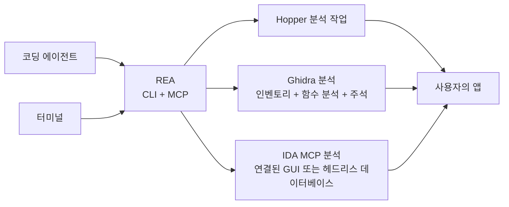

<div align="center">

[English](README.md) · [简体中文](README_zh.md) · [日本語](README_ja.md) · **한국어** · [العربية](README_ar.md)

# REA: 무엇이든 리버스 엔지니어링

### 바이너리, 애플리케이션, 런타임 동작을 아우르는 리버스 엔지니어링용 MCP 하나.

**마음에 드는 기능을 발견했다면 바이너리 수준까지 내려가 작동 방식을 이해하세요.**

[](https://www.npmjs.com/package/rea-agents)
[](https://github.com/morluto/rea/actions/workflows/ci.yml)
[](#조사-도구-카탈로그)
[](https://nodejs.org/)
[](LICENSE)
[](https://discord.gg/GkcryMnJDM)

<a href="https://trendshift.io/repositories/82054?utm_source=repository-badge&amp;utm_medium=badge&amp;utm_campaign=badge-repository-82054" target="_blank" rel="noopener noreferrer"></a>

**[웹사이트(영문)](https://morluto.github.io/rea/) · [가이드](https://morluto.github.io/rea/guides/) · [DX-Ball 사례](https://morluto.github.io/rea/showcase/dx-ball/)**

[빠른 시작](#빠른-시작) · [현재 지원 범위](#현재-지원-범위) · [바이너리에서 동작까지](#바이너리에서-동작까지) · [조사 도구 카탈로그](#조사-도구-카탈로그) · [로드맵](#로드맵) · [작동 방식](#작동-방식)

<table aria-label="REA community">
<tr>
<td align="center" width="360">
  <a href="https://discord.gg/GkcryMnJDM">
    <br />
    <strong>리버스 엔지니어링 커뮤니티에 참여하세요</strong>
  </a><br />
  <sub>Discord · 질문과 답변 · 작업 공유</sub>
</td>
</tr>
</table>

<br />

<code>npx rea-agents setup</code>

<br />


</div>

---

앱에서 내 제품에도 넣고 싶은 기능을 발견했다면 에이전트에게 REA로 조사해 달라고 요청하세요. 에이전트는 소스 코드 없이도 앱을 검사하고, 기능의 작동 방식과 근거를 설명한 뒤, 프로젝트에 맞는 버전을 구현할 수 있습니다.

REA는 네이티브 바이너리, JavaScript/Electron 앱, .NET 어셈블리, 웹사이트를 검사하는 도구를 에이전트에 연결합니다. 같은 도구를 터미널에서도 사용할 수 있습니다. 분석은 로컬에서 실행되며, 결과에는 각 결론의 근거와 제한 사항이 함께 담깁니다.

Setup은 REA를 에이전트에 등록하고 버전에 맞는 워크플로 지침을 설치합니다. 네이티브 분석에는 기존 Hopper 또는 Ghidra 설치를 사용할 수 있으며, 승인하면 Setup이 Hopper를 설치할 수도 있습니다. 정적 JavaScript 분석에는 두 엔진 모두 필요하지 않습니다.

## 에이전트에게 바로 요청하기

[설정](#빠른-시작)을 마친 뒤 에이전트를 다시 시작하고 요청하세요.

```text
메모 앱의 검색 기능이 어떻게 동작하는지 조사하고 근거를 보여 주세요.
그다음 제 프로젝트에 비슷한 기능을 구현해 주세요.
```

메모 앱 대신 이해하려는 앱을 지정하거나, 먼저 개요를 요청해도 됩니다.

## 바이너리에서 동작까지

| 디컴파일                                                                                                      | 이해                                                                                        | 재현                                                                                        |
| ------------------------------------------------------------------------------------------------------------- | ------------------------------------------------------------------------------------------- | ------------------------------------------------------------------------------------------- |
| 네이티브 앱이나 실행 파일에서 프로시저, 의사 코드, 어셈블리, 문자열, 심볼, 세그먼트, 메타데이터를 복구합니다. | 호출자, 피호출자, 상호 참조, 호출 그래프를 따라 기능이나 알고리즘의 실제 동작을 설명합니다. | 에이전트가 파악한 내용을 사용자의 기술 스택, 화면, 요구 사항에 맞는 제품 기능으로 만듭니다. |

REA는 어떤 근거로 결론에 이르렀는지 보여 줍니다. 원본 소스 코드를 복구하거나 앱 전체를 자동으로 복제한다고 주장하지 않습니다.

## REA를 사용하는 이유

|                     |                                                                                                |
| ------------------- | ---------------------------------------------------------------------------------------------- |
| **에이전트용**      | 앱이 무엇을 하는지 물으면 에이전트가 추측하는 대신 직접 검사합니다.                            |
| **CLI와 MCP**       | 터미널과 에이전트에서 동일한 리버스 엔지니어링 기능을 사용합니다.                              |
| **안내식 설정**     | 에이전트 설정, 기존 분석 도구 연결, 승인 후 Hopper 설치를 지원합니다.                          |
| **통찰에서 코드로** | 기능을 이해한 뒤 같은 코딩 세션에서 내 제품에 맞는 버전을 구현합니다.                          |
| **로컬 분석**       | 분석은 지원되는 로컬 호스트에서 실행되며, REA는 앱을 호스팅 분석 서비스에 업로드하지 않습니다. |
| **컨텍스트 유지**   | 질문할 때마다 처음부터 다시 시작하지 않고 여러 앱을 조사합니다.                                |

## 빠른 시작

### 설정 실행하기(권장)

REA를 에이전트에 연결하세요.

```bash
npx rea-agents setup
```

지원되는 에이전트 중 REA를 사용할 에이전트를 고른 뒤, 정확한 경로와 변경 사항을 검토하고 승인하세요. 기존 REA 등록은 기본으로 선택됩니다. 새로 감지된 에이전트는 선택할 수 있도록 표시되지만, 감지되었다는 이유만으로 선택되지는 않습니다. Setup은 선택한 에이전트에 MCP 연결과 REA의 안내형 워크플로를 추가합니다. Hopper 설치는 별도의 선택 사항이며 따로 동의해야 합니다. 기존 Ghidra 설치를 등록할 수도 있습니다.

Setup은 변경 사항을 적용하기 전에 먼저 보여 주고 기존 설정을 백업합니다. 요구 사항과 설정 옵션은 [설치 및 설정](docs/installation.md)을 참고하세요.

### 에이전트에서 사용하기

설정을 마쳤으면 에이전트를 다시 시작하고 [이해하려는 앱이나 기능을 설명](#에이전트에게-바로-요청하기)하세요. REA는 Claude Code, Claude Desktop, Codex, Cursor, Gemini CLI, Windsurf, Devin, OpenCode, Antigravity, GitHub Copilot CLI, Command Code, VS Code를 지원합니다. 설정 중 기존 REA 등록은 기본으로 선택되고, 그 밖에 감지된 에이전트는 직접 선택해야 합니다. 다른 에이전트는 [아래 MCP 설정](#다른-코딩-에이전트에서-사용하기)을 사용할 수 있습니다.

Hopper는 데모 모드로 실행할 수 있습니다. 첫 실행 안내가 나타나면 데모를 선택하거나 기존 라이선스를 입력하세요.

### AI 코딩 어시스턴트용 스킬(선택)

AI 코딩 어시스턴트에 스킬을 추가하면 더 풍부한 컨텍스트를 얻을 수 있습니다.

```bash
npx skills add morluto/rea --skill reverse-engineer-anything
```

이 스킬은 REA의 조사 워크플로를 제공합니다. REA를 에이전트에 연결하고 분석 도구를 설정하려면 위의 setup을 실행하세요. Setup은 이미 기본적으로 버전에 맞는 스킬을 설치하며, 이 명령은 저장소 버전의 스킬을 설치합니다.

압축을 해제한 JavaScript/Electron 앱 트리나 ASAR 파일은 다음 명령으로 바로 분석할 수 있습니다.

```bash
npx -y rea-agents@latest analyze-javascript-application /absolute/path/to/app --json
```

경로는 조사 대상으로 바꾸세요(예: Windows에서는 `"D:/apps/example"`). 이 명령은 MCP 설정, Hopper, Ghidra 없이, 그리고 애플리케이션을 실행하지 않고 Evidence, 복구된 그래프, 제한 사항, 미확인 사항을 바로 반환합니다. 네이티브 앱은 먼저 해당 엔진을 설정한 뒤 그 앱의 경로로 `analyze`를 실행하세요. `doctor`는 진단이 필요할 때 실행하면 되며, 분석할 때마다 먼저 실행해야 하는 것은 아닙니다.

### rea 명령 설치하기

명령줄 도구를 설치하세요.

```bash
curl -fsSL https://raw.githubusercontent.com/morluto/rea/main/install.sh | bash
```

설치 프로그램은 시스템에 `rea`를 추가하고, 터미널에서 실행한 경우 설정을 시작합니다. Node.js와 npm이 미리 설치되어 있어야 합니다.

npm으로 설치한 뒤 설정을 실행할 수도 있습니다.

```bash
npm install --global rea-agents
rea setup
```

### 요구 사항

정적 JavaScript 검사에는 Node/npm 런타임만 있으면 됩니다. 호스트와 외부 도구의 전제 조건은 선택한 워크플로에 따라 다르며, 각 네이티브 제공자 가이드에 지원 플랫폼이 설명되어 있습니다.

- macOS 12 이상
- Ubuntu 24.04+, Fedora 41+, 64비트 Arch Linux 또는 CachyOS
- Node.js 22.x (>=22.19), 24.x (>=24.11) 또는 26+
- npm(REA는 특정 npm 버전을 요구하거나 설치하지 않습니다)

심층 네이티브 바이너리 분석에는 Hopper, Ghidra 또는 IDA Pro가 필요합니다. Hopper는 자체 라이선스가 있는 별도 소프트웨어이며, 데모 버전에서도 공급업체가 정한 제한 안에서 분석할 수 있습니다. Ghidra와 IDA는 사용자가 직접 준비하는(BYO) 제공자입니다. IDA Pro 연동은 [IDA 제공자 가이드](docs/ida-provider.md)를 참고하세요.

Ghidra는 Linux x64와 macOS x64/arm64를 지원합니다. Ghidra 12.1.x와 해당 설치본이 선언한 64비트 전체 JDK(`application.java.min`부터 `application.java.max`까지)를 별도로 설치한 뒤 REA가 사용하도록 설정하세요. 현재 12.1 릴리스는 JDK 21 이상을 요구하며 상한은 없습니다. 브리지는 Ghidra 12.1.4와 JDK 21에서 검증되었습니다. macOS에서는 사용 중인 아키텍처에 맞는 네이티브 디컴파일러도 Ghidra 설치에 포함되어 있어야 합니다.

Setup은 설치를 확인하고, 승인을 받으면 선택한 에이전트 설정에 경로를 저장합니다. Ghidra와 Java는 미리 설치되어 있어야 하며, REA는 Ghidra, Java, Node.js, npm, Homebrew를 내려받거나 변경하지 않습니다.

저장소 main과 npm 4.1.0에는 로컬 NTFS의 네이티브 x86-64 PE 애플리케이션(비관리 코드, DLL 제외)을 위한 실험적인 Windows x64 Ghidra P0 지원이 포함되어 있습니다. Job Object, 비공개 DACL, 경로 허용 제어가 함께 제공됩니다. 이전 npm 패키지에도 이 기능이 포함되어 있는지 [릴리스 경계](docs/installation.md#released-package-and-main)에서 먼저 확인하세요. 전제 조건과 검증 범위는 [Windows Ghidra P0](docs/windows-ghidra-p0.md)를 참고하세요.

### 문제 해결

`npx -y rea-agents@latest doctor`는 호스트, 의존성, 분석 도구, 에이전트 설정을 변경하지 않고 확인합니다. 구조화된 진단 결과가 필요하면 `--json`을 추가하세요.

Linux에서는 실행 가능한 `/opt/hopper/bin/Hopper`를 우선 사용하고, 사용할 수 없으면 `~/.local/share/rea/hopper/bin/Hopper`를 자동으로 확인합니다. Hopper를 다른 위치에 설치했다면 `HOPPER_LAUNCHER_PATH`를 설정하세요. 파일이 있는데도 doctor가 분석 엔진이 없다고 보고하면 실제 Hopper 경로로 `ldd /absolute/path/to/Hopper | grep 'not found'`를 실행해 누락된 공유 라이브러리를 확인하고, 해당 패키지를 설치한 뒤 `rea setup`을 다시 실행하세요. 자세한 내용은 [Hopper 설치 안내](docs/installation.md#hopper)를 참고하세요.

### 업데이트와 제거

- `rea update`는 현재 REA 설치를 업데이트합니다.
- `rea uninstall`은 REA가 소유한 MCP 등록과 관리 대상 스킬만 제거합니다. Hopper, Node.js, Evidence 파일, 캡처, 관련 없는 스킬, 다른 MCP 서버는 그대로 유지됩니다.
- `rea uninstall --purge-data`는 `~/.rea/cache`와 `~/.rea/state`도 삭제합니다. 해당 데이터를 지우려는 경우에만 사용하세요.

## 현재 지원 범위

REA는 macOS와 Linux에서 네이티브 애플리케이션, JavaScript, Electron, .NET, 브라우저 조사를 지원하며, 도구마다 플랫폼과 런타임 전제 조건이 다릅니다. 저장소의 현재 기능과 플랫폼 요구 사항은 [영문 지원 가이드](README.md#current-status)에 자세히 설명되어 있습니다. 저장소 main은 [npm 릴리스](docs/installation.md#released-package-and-main)보다 앞설 수 있습니다.

- Mach-O, ELF, PE, Mac `.app` 대상은 선택한 심층 분석 제공자로 엽니다. Hopper와 Ghidra는 폭넓은 인벤토리와 함수 분석을 제공하고, IDA 어댑터는 문서화된 읽기 전용 함수/문자열 작업을 제공합니다. Hopper는 `.hop` 데이터베이스도 열 수 있으며 주석을 지원합니다.
- Ghidra는 Linux x64, macOS x64/arm64와 실험적인 Windows x64 P0에서 25개의 읽기 전용 작업을 제공합니다. Windows x64 Ghidra P0는 고정 로컬 NTFS에 있는 네이티브 x86-64 PE 애플리케이션(비관리 코드, DLL 제외)을 지원합니다. Linux/macOS의 Ghidra는 세션 범위의 원자적 함수 이름 및 진입점 주석 편집도 추가로 지원합니다. Ghidra에는 GUI 제어가 없으며, Windows P0에는 변경 권한이 없습니다.
- 정적 Android APK 검사는 Linux와 macOS를 지원하며, 별도로 준비한 헤드리스 JADX JAR과 전체 JDK가 필요합니다. 현재 메타데이터 브리지는 macOS arm64에서 헤드리스 JADX로 검증되었습니다. [Android 분석](docs/android-analysis.md)을 참고하세요.
- 브라우저, Electron, 프로세스 요청은 대상, 동작, 수명 주기를 요청에 직접 지정하며, 분석 도구와 실행된 대상은 현재 사용자 권한으로 동작합니다. 별도의 REA 권한 승인은 필요하지 않지만, Setup의 설정 변경과 Hopper 설치에는 여전히 정확한 계획에 대한 승인이 필요합니다.
- `rea capabilities`와 `rea providers`는 바이너리 세션 제공자와 보조 작업을 설명할 뿐, 모든 브라우저, Android, 애플리케이션 워크플로의 목록은 아닙니다. 전체 MCP 기능은 연결된 MCP 도구 목록과 `binary_session` 도구 가용성을, 각 도구의 전제 조건은 관련 가이드를 참고하세요.

## 하나의 프롬프트로 전체 조사

```text
메모 앱을 리버스 엔지니어링해 오프라인 검색 기능의 작동 방식을 설명한 다음,
TypeScript와 SQLite를 사용해 제 프로젝트에 맞는 버전을 구현해 주세요.
```

| 단계 | 에이전트 작업           | REA 도구                                                         |
| ---: | ----------------------- | ---------------------------------------------------------------- |
|    1 | 바이너리 열기 및 식별   | `open_binary`, `binary_overview`                                 |
|    2 | 오프라인 검색 단서 찾기 | `search_strings`, `search_procedures`, `list_names`              |
|    3 | 단서를 실행 코드에 연결 | `find_xrefs_to_name`, `xrefs`, `procedure_callers`               |
|    4 | 제어 흐름 재구성        | `get_call_graph`, `procedure_callees`, `procedure_info`          |
|    5 | 관련 루틴 디컴파일      | `procedure_pseudo_code`, `procedure_assembly`, `batch_decompile` |
|    6 | 프로젝트에 기능 구현    | 기술 스택, 제품, 요구 사항에 맞는 코드                           |

REA는 1–5단계의 앱 분석을 처리합니다. 6단계는 에이전트가 앱에서 파악한 내용을 바탕으로 일반적인 파일 편집 및 테스트 도구를 사용해 수행합니다.

## 에이전트가 할 수 있는 일

- 소스 코드를 구할 수 없는 기능의 작동 방식을 설명합니다.
- 앱의 인증, 저장소, 업데이트 또는 네트워크 흐름을 재구성합니다.
- 문서화되지 않은 형식이나 인터페이스를 문서화할 수 있을 만큼 구조를 복구합니다.
- 의심스러운 동작을 문자열이나 심볼에서 시작해 이를 구현한 코드까지 추적합니다.
- 한 세션에서 두 앱 버전을 전환하며 구현 경로를 비교합니다.
- 마음에 드는 기능을 조사하고 내 제품에 맞는 버전으로 구현합니다.
- 복구한 동작을 제품 기능, 테스트, 마이그레이션 문서, 포팅 또는 상호 운용 가능한 대체품으로 바꿉니다.
- 맹글링된 심볼을 일일이 풀지 않고도 Swift 및 Objective-C 메타데이터를 분석합니다.
- Hopper에 이름, 주석, 북마크를 남겨 사람과 에이전트의 분석이 서로를 보완하게 합니다.

## 조사 도구 카탈로그

| 도구 분류         |  수 | 예시                                                                                                                                           |
| ----------------- | --: | ---------------------------------------------------------------------------------------------------------------------------------------------- |
| 네이티브 검사     |  41 | 함수, 의사 코드, 어셈블리, 문자열, 심볼, 호출, 참조, 주석, 바이트 읽기, 파일 오프셋                                                            |
| 조사 워크플로     |  14 | 앱 개요, 함수 종합 정보, 네이티브 API와 디스패치, 일괄 디컴파일, 기능 추적, 호출 경로, 호출 그래프, Swift와 Objective-C 탐색                   |
| macOS 네이티브    |   7 | Hopper를 실행하지 않고 처리하는 Mach-O 메타데이터, 코드 서명, plist, 아키텍처, Swift 디맹글링                                                  |
| 아티팩트 그래프   |   5 | 디렉터리와 패키지 인벤토리, 컴파일된 Interface Builder 파일, Apple 에셋 카탈로그, 추출                                                         |
| 관리 PE/CLI       |   7 | .NET ID, 메타데이터, CIL 명령어, 네이티브 의존성, 재구성 가져오기, 빌드 비교                                                                   |
| 펌웨어            |   2 | Linux 펌웨어 영역 검사 및 명시적 추출                                                                                                          |
| Android APK       |   5 | 패키지와 manifest 선언, 클래스 검색, 멤버 인벤토리, 메서드 디컴파일, 들어오는 정적 참조                                                        |
| 브라우저 관찰     |  11 | 페이지 구조, 네트워크 메타데이터, 스크립트, 소스 맵, WebMCP 탐색, 스크린샷, 캡처 비교                                                          |
| Electron 분석     |   5 | 렌더러 관찰, 정적 앱 매핑, 정적·런타임 결과 연결                                                                                               |
| JavaScript 런타임 |   2 | Node/Electron Inspector 대상 탐색, 스크립트 위치, 실행 컨텍스트 이벤트                                                                         |
| 앱 워크플로       |  13 | 캡처한 웹사이트 스크립트 내보내기, Android/Apple 인벤토리 투영, 계층 간 기능 추적, 빌드 비교, 과거 소스 매핑, 정적 반환 구조 비교, 재구성 검증 |
| 작업 공간과 관찰  |  21 | 세션, Evidence 번들, 탐색 컨텍스트, 프로세스·아티팩트·함수 비교, 미해결 질문 추적                                                              |

## 로드맵

현재 제공되는 기능은 [현재 지원 범위](#현재-지원-범위)에 설명되어 있습니다. 지금은 생성된 카탈로그와 문서를 정확하게 유지하고 Hopper와 Ghidra에서 더 많은 네이티브 바이너리를 테스트하는 데 집중하고 있습니다. 다음으로는 기능 추적에 더 많은 애플리케이션 계층을 연결하고, .NET 분석을 확장하고, 런타임 동작 비교 범위를 넓힐 예정입니다. 이후에는 브라우저와 Electron 상호 작용 확대, 네이티브 앱 런타임 관찰, 추가 도구와 대상 평가를 검토합니다. IDA 지원은 사용자가 직접 준비하는 업스트림 어댑터로 이미 제공됩니다([IDA 제공자 가이드](docs/ida-provider.md)).

Setup은 이미 에이전트 연동과 Hopper 설치를 선택할 수 있도록 지원합니다. 다른 분석 도구 설치 지원은 향후 작업입니다. [설치 로드맵](docs/roadmap.md)과 [제공자 평가](docs/provider-evaluation.md)를 참고하세요.

## 다른 코딩 에이전트에서 사용하기

Setup은 Claude Code, Claude Desktop, Codex, Cursor, Gemini CLI, Windsurf, Devin, OpenCode, Antigravity, GitHub Copilot CLI, Command Code, VS Code를 지원합니다. 기존 REA 등록은 기본으로 선택되고, 새로 감지된 에이전트는 직접 선택해야 합니다. 로컬 MCP 서버를 지원하는 에이전트라면 다음 설정으로 연결할 수 있습니다.

<!-- x-release-please-start-version -->

```json
{
  "mcpServers": {
    "rea": {
      "command": "npx",
      "args": ["-y", "rea-agents@5.0.0", "mcp"]
    }
  }
}
```

<!-- x-release-please-end -->

## 작동 방식



CLI와 MCP 서버는 같은 애플리케이션 워크플로와 Evidence 계약을 사용합니다. 각 제공자는 지원하는 기능과 그 기능이 일으킬 수 있는 부수 효과를 선언합니다. 터미널 명령은 짧게 실행되고 끝나며, MCP 세션은 세션 동안 활성 대상과 Evidence 기록을 유지할 수 있습니다. REA 세션을 닫아도 사용자가 이용 중인 Hopper 앱은 종료되지 않습니다.

## CLI

위의 에이전트 워크플로가 REA를 사용하는 가장 쉬운 방법입니다. 터미널에서 앱을 한 번 빠르게 살펴보려면 다음을 실행하세요.

```bash
npx -y rea-agents@latest analyze /Applications/Notes.app
```

직접 디컴파일하는 방법과 기타 옵션은 `npx -y rea-agents@latest --help`에서 확인할 수 있습니다.

전역 `rea` 명령으로 설치할 수도 있습니다.

```bash
npm install --global rea-agents
rea --help
rea mcp
```

REA는 Mac의 `.app` 폴더를 직접 열 수 있습니다. 에이전트가 이름만으로 앱을 찾지 못하면 설치 위치를 알려 주세요.

## Hopper 앱 동작

REA는 작업에 필요할 때 Hopper를 시작합니다. Hopper 런처는 내부적으로 앱을 활성화하므로 대상을 열 때 Hopper가 다른 창 앞으로 나타날 수 있습니다. REA는 백그라운드 시작을 요청하지만, Hopper가 항상 뒤에 머문다고 보장할 수는 없습니다.

명시적인 형식과 아키텍처 인자를 전달해 일반적인 FAT/ARM 선택 대화상자는 피하지만, 그 밖의 Hopper 또는 macOS 대화상자나 데모·라이선스 안내에는 사용자가 직접 응답해야 할 수 있습니다. 세션을 닫으면 REA의 브리지를 종료하고 임시 소켓 디렉터리를 제거하지만, 사용자가 작업 중인 Hopper 앱은 종료하지 않습니다.

## 보안 모델

분석은 로컬에서 실행됩니다. REA는 Hopper 및 Ghidra와는 인증된 비공개 로컬 소켓으로, IDA와는 설정된 로컬 MCP 등록을 통해 통신합니다. Ghidra 세션은 대상의 임시 사본과 격리된 임시 프로젝트를 사용하며, 사용자 소유의 Ghidra 프로젝트를 열거나 수정하지 않습니다. 이는 샌드박스가 아니며 같은 운영 체제 사용자로 실행되는 악성 프로세스를 막아 주지 않습니다. 신뢰할 수 없는 바이너리를 열면 선택한 로컬 제공자가 현재 사용자 권한으로 분석하며, 실행된 대상도 같은 권한으로 동작합니다. 네이티브 UI 캡처에는 macOS의 손쉬운 사용 및 화면 기록 권한이 필요합니다. Windows Ghidra P0는 네이티브 Job Object, 보호된 비공개 런타임 DACL, 핸들 기반 허용 제어를 자동으로 사용합니다. 취약점은 [SECURITY.md](SECURITY.md)의 비공개 절차로 신고하세요.

## FAQ

<details><summary><strong>Hopper를 미리 실행해야 하나요?</strong></summary>

아니요. REA가 작업에 필요할 때 Hopper를 시작합니다. 이미 실행 중인 Hopper 앱도 지원하지만, 기존 GUI 문서에 연결하는 대신 새 분석 문서를 엽니다.

</details>

<details><summary><strong>REA에 Hopper가 포함되나요?</strong></summary>

아니요. Setup으로 Hopper를 설치할 수는 있지만, Hopper는 자체 라이선스가 있는 별도 소프트웨어입니다. REA는 에이전트가 Hopper를 활용할 수 있도록 CLI, MCP 서버, 워크플로를 제공합니다.

</details>

<details><summary><strong>바이너리가 업로드되나요?</strong></summary>

REA에는 호스팅 분석 서비스가 없습니다. 현재 제공자는 모두 로컬에서 아티팩트를 분석하고 동작을 캡처합니다. 에이전트나 모델 제공자에는 자체 데이터 정책이 있을 수 있으므로 별도로 확인하세요.

</details>

<details><summary><strong>원본 소스 코드를 복구할 수 있나요?</strong></summary>

어떤 디컴파일러도 원본 소스를 보장할 수는 없습니다. REA는 의사 코드, 어셈블리, 심볼, 문자열, 메타데이터, 관계 정보를 에이전트에 제공하며, 에이전트는 이를 바탕으로 관찰된 동작을 설명하거나 호환되게 재현할 수 있습니다.

</details>

## 개발

개발 환경, 아키텍처, 테스트, 릴리스 지침은 [CONTRIBUTING.md](CONTRIBUTING.md)를 참고하세요.

## 라이선스

[MIT](LICENSE)
