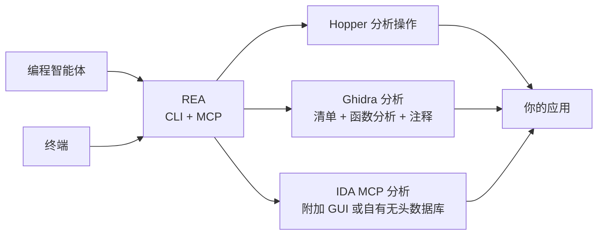

<div align="center">

[English](README.md) · **简体中文** · [日本語](README_ja.md) · [한국어](README_ko.md) · [العربية](README_ar.md)

# REA：逆向工程一切

### 一个 MCP，覆盖二进制文件、应用与运行时行为的逆向工程。

**看到喜欢的功能？深入到二进制层面，弄清它的工作原理。**

[](https://www.npmjs.com/package/rea-agents)
[](https://github.com/morluto/rea/actions/workflows/ci.yml)
[](#调查工具目录)
[](https://nodejs.org/)
[](LICENSE)
[](https://discord.gg/GkcryMnJDM)

<a href="https://trendshift.io/repositories/82054?utm_source=repository-badge&amp;utm_medium=badge&amp;utm_campaign=badge-repository-82054" target="_blank" rel="noopener noreferrer"></a>

**[网站（英文）](https://morluto.github.io/rea/) · [使用指南](https://morluto.github.io/rea/guides/) · [DX-Ball 案例](https://morluto.github.io/rea/showcase/dx-ball/)**

[快速开始](#快速开始) · [当前状态](#当前状态) · [从二进制到行为](#从二进制到行为) · [调查工具目录](#调查工具目录) · [路线图](#路线图) · [工作原理](#工作原理)

<table aria-label="REA community">
<tr>
<td align="center" width="360">
  <a href="https://discord.gg/GkcryMnJDM">
    <br />
    <strong>加入逆向工程社区</strong>
  </a><br />
  <sub>Discord · 问答 · 成果分享</sub>
</td>
</tr>
</table>

<br />

<code>npx rea-agents setup</code>

<br />


</div>

---

看到某个应用里有你想放进自己产品的功能？让智能体用 REA 去调查。即使没有源代码，它也能检查应用、解释功能如何实现、给出证据，并为你的项目构建类似的版本。

REA 为智能体接入用于检查原生二进制文件、JavaScript 与 Electron 应用、.NET 程序集和网站的工具，你也可以在终端中使用同一套工具。分析在本地运行，每项结论都会附带其依据的证据和局限。

Setup 会把 REA 注册到你的智能体，并安装版本匹配的工作流说明。原生分析可以使用已安装的 Hopper 或 Ghidra；在你批准后，Setup 也可以安装 Hopper。静态 JavaScript 分析不需要任何分析引擎。

## 直接询问智能体

完成[设置](#快速开始)后，重启智能体并提出问题：

```text
解释“备忘录”应用的搜索功能，展示证据，然后为我的项目实现类似功能。
```

把“备忘录”换成你想了解的应用，也可以先让智能体给出概览。

## 从二进制到行为

| 反编译                                                                       | 理解                                                                                   | 重建                                                         |
| ---------------------------------------------------------------------------- | -------------------------------------------------------------------------------------- | ------------------------------------------------------------ |
| 打开原生应用或可执行文件，恢复过程、伪代码、汇编、字符串、符号、段和元数据。 | 沿调用者、被调用者、交叉引用和调用图追踪，直到智能体能够解释功能或算法的实际工作方式。 | 将智能体学到的内容变成适合你的技术栈、界面和需求的产品功能。 |

REA 会展示它得出结论的依据。它不声称能恢复原始源代码，也不会自动克隆整个应用。

## 为什么选择 REA

|                  |                                                                  |
| ---------------- | ---------------------------------------------------------------- |
| **为智能体设计** | 直接询问应用的行为，让智能体去检查，而不是猜测。                 |
| **CLI 与 MCP**   | 在终端或智能体中使用同一套逆向工程能力。                         |
| **引导式设置**   | 配置智能体、连接已有分析工具，或在你批准后安装 Hopper。          |
| **从洞察到代码** | 理解功能后，在同一次编程会话中构建属于你自己的版本。             |
| **本地运行**     | 分析在受支持的本机系统上运行；REA 不会把应用上传到托管分析服务。 |
| **保留上下文**   | 连续调查多个应用，无需为每个问题重新开始整个分析过程。           |

## 快速开始

### 运行设置（推荐）

配置 REA 与智能体的连接：

```bash
npx rea-agents setup
```

先选择要使用 REA 的受支持智能体，查看具体路径和变更后再批准。已有的 REA 注册默认选中；新检测到的智能体可供选择，但仅被检测到并不会自动选中。Setup 会为所选智能体添加 MCP 访问和 REA 引导式工作流。Hopper 是单独的可选项，需要单独同意。Setup 也可以记录已安装的 Ghidra 路径。

Setup 会在应用变更前先展示它们，并备份已有配置。系统要求和更多设置选项见[安装与设置](docs/installation.md)。

### 使用智能体

设置完成后，重启智能体并[描述](#直接询问智能体)你想了解的应用或功能。REA 支持 Claude Code、Claude Desktop、Codex、Cursor、Gemini CLI、Windsurf、Devin、OpenCode、Antigravity、GitHub Copilot CLI、Command Code 和 VS Code。Setup 期间，已有的 REA 注册默认选中；其他检测到的智能体需手动选择。其他智能体可以使用[手动 MCP 配置](#与其他编程智能体一起使用)。

Hopper 可以在演示模式下运行；如果首次启动时出现提示，选择演示模式或输入已有许可证。

### AI 编程助手技能（可选）

为你的 AI 编程助手添加技能（skill），以获得更丰富的上下文：

```bash
npx skills add morluto/rea --skill reverse-engineer-anything
```

该技能提供 REA 的调查工作流。请先运行上文的 Setup，把 REA 连接到智能体并配置分析工具。Setup 默认已安装版本匹配的技能；这条命令安装的是仓库中的版本。

对于已解包的 JavaScript/Electron 应用目录或 ASAR 文件，直接运行：

```bash
npx -y rea-agents@latest analyze-javascript-application /absolute/path/to/app --json
```

把路径换成你的目标（例如 Windows 上的 `"D:/apps/example"`）。该命令会直接返回 Evidence、恢复出的关系图、局限和未知项，无需配置 MCP、Hopper 或 Ghidra，也不会执行应用。对于原生应用，请先配置对应的分析引擎，再对该应用路径运行 `analyze`。需要诊断时再运行 `doctor`，它不是每次分析的前提。

### 安装 rea 命令

安装命令行工具：

```bash
curl -fsSL https://raw.githubusercontent.com/morluto/rea/main/install.sh | bash
```

安装程序会把 `rea` 安装到系统中，在终端中运行时还会启动 Setup。它要求预先安装 Node.js 和 npm。

也可以用 npm 安装，再运行设置：

```bash
npm install --global rea-agents
rea setup
```

### 系统要求

- macOS 12 或更高版本
- Ubuntu 24.04+、Fedora 41+、64 位 Arch Linux 或 CachyOS
- Node.js 22.x (>=22.19)、24.x (>=24.11) 或 26+
- npm；REA 不要求也不会安装特定的 npm 版本

深度原生二进制分析需要 Hopper、Ghidra 或 [IDA Pro](docs/ida-provider.md)。Hopper 是独立软件，有自己的许可证；其演示版可在厂商规定的限制内进行分析。Ghidra 和 IDA 需要自备。

Ghidra 支持 Linux x64 和 macOS x64/arm64。请自行安装 Ghidra 12.1.x，以及该安装在 `application.java.min` 到 `application.java.max` 范围内声明的 64 位完整 JDK，然后配置 REA 使用它们。当前 12.1 发行版要求 JDK 21 或更高版本，且未设上限。桥接已在 Ghidra 12.1.4 和 JDK 21 上完成验证。在 macOS 上，Ghidra 安装还必须包含对应架构的原生反编译器。

Setup 会检查这些安装，并在你批准后把路径保存到所选智能体的配置中；它不会下载、安装或升级 Ghidra、Java、Node.js、npm 或 Homebrew。

仓库 main 分支与 npm 4.1.0 已包含实验性的 Windows x64 Ghidra P0 支持，适用于本地 NTFS 上的原生 x86-64 PE 应用（非托管、非 DLL），并内置 Job Object、私有 DACL 和路径准入控制。如果使用较旧的 npm 包，请先查看[发布边界](docs/installation.md#released-package-and-main)，确认其是否包含该功能。前置条件与已验证范围见 [Windows Ghidra P0](docs/windows-ghidra-p0.md)。

### 故障排除

如果遇到问题，运行 `npx -y rea-agents@latest doctor`。它会检查主机、依赖、分析工具和智能体配置，但不会修改它们。添加 `--json` 可获得结构化诊断结果。

在 Linux 上，REA 优先使用可执行的 `/opt/hopper/bin/Hopper`；如果不可用，会自动检查 `~/.local/share/rea/hopper/bin/Hopper`。如果 Hopper 安装在其他位置，请通过 `HOPPER_LAUNCHER_PATH` 指定。如果文件存在但 `doctor` 仍报告缺少分析引擎，请对实际的 Hopper 路径运行 `ldd /absolute/path/to/Hopper | grep 'not found'`，检查缺失的共享库。安装详情见 [Hopper 安装指南](docs/installation.md#hopper)。

### 更新与卸载

- `rea update` 更新当前的 REA 安装。
- `rea uninstall` 仅移除 REA 所属的 MCP 注册和受管技能，保留 Hopper、Node.js、Evidence 文件、捕获数据、无关的技能和其他 MCP 服务器。
- `rea uninstall --purge-data` 还会删除 REA 的缓存和状态（仅限 `~/.rea/cache` 和 `~/.rea/state`）。仅在需要移除这些数据时使用。

## 当前状态

REA 支持在 macOS 和 Linux 上调查原生应用、JavaScript、Electron、.NET 和网站，各工具另有平台与运行时前置条件。完整的能力与平台要求见[英文 README 的 Current status 部分](README.md#current-status)。仓库 main 分支可能领先于 [npm 发布版](docs/installation.md#released-package-and-main)。

- 原生二进制：通过所选的深度分析提供方打开 Mach-O、ELF、PE 和 Mac `.app` 目标。Hopper 和 Ghidra 覆盖广泛的清单与函数分析；IDA 适配器提供其文档所列的只读函数与字符串操作。Hopper 还支持 `.hop` 数据库和注释。
- Ghidra 在 Linux x64、macOS x64/arm64 以及实验性的 Windows x64 P0 边界上提供 25 个只读操作。Linux/macOS 还支持原子化、会话级的函数名称与入口注释编辑。Windows P0 没有修改权限；Ghidra 不提供 GUI 控制。
- 静态 Android APK 检查支持 Linux 和 macOS，需要自备 headless JADX 和完整 JDK，前置条件独立；当前元数据桥接已在 macOS arm64 上配合 headless JADX 完成验证。详见 [Android 分析](docs/android-analysis.md)。
- 浏览器、Electron 和进程类请求直接声明目标、操作和生命周期，按宿主实际授予的访问权限运行，REA 不再另设授权。Setup 写入配置和安装 Hopper 时，仍需你逐项批准确切的计划。
- `rea capabilities` 和 `rea providers` 描述的是二进制会话的分析提供方和辅助操作，并不涵盖所有浏览器、Android 或应用工作流。完整的 MCP 能力请以已连接的 MCP 工具列表、`binary_session` 工具可用性及相关指南为准。

## 一个提示词，完成一次完整调查

```text
逆向工程“备忘录”应用，找到离线搜索功能的工作方式，解释其控制流，
并使用 TypeScript 和 SQLite 为我的项目构建一个版本。
```

| 步骤 | 智能体的操作           | REA 工具                                                         |
| ---: | ---------------------- | ---------------------------------------------------------------- |
|    1 | 打开并识别二进制文件   | `open_binary`, `binary_overview`                                 |
|    2 | 搜索可能的离线搜索线索 | `search_strings`, `search_procedures`, `list_names`              |
|    3 | 将线索连接到可执行代码 | `find_xrefs_to_name`, `xrefs`, `procedure_callers`               |
|    4 | 重建相关控制流         | `get_call_graph`, `procedure_callees`, `procedure_info`          |
|    5 | 反编译相关程序         | `procedure_pseudo_code`, `procedure_assembly`, `batch_decompile` |
|    6 | 在你的项目中构建该功能 | 适合你的技术栈、产品和需求的代码                                 |

REA 负责第 1–5 步的应用分析；第 6 步由智能体结合对应用的了解，使用其常规的文件编辑和测试工具完成。

## 智能体可以完成什么

- 在没有源代码时解释某项功能的实现方式。
- 重建应用的身份验证、存储、更新或网络流程。
- 恢复足够的结构，以记录未公开的格式或接口。
- 从字符串或符号出发，追踪到实现可疑行为的代码。
- 在一个会话中切换两个应用版本并比较实现路径。
- 调查你喜欢的功能，并为自己的产品构建量身定制的版本。
- 将恢复的行为转换为产品功能、测试、迁移说明、移植代码或互操作替代品。
- 分析 Swift 和 Objective-C 元数据，无需手动解开每个经过名称修饰的符号。
- 在 Hopper 中留下名称、注释与书签，让人工分析与智能体分析相互促进。

## 调查工具目录

| 工具类别          | 数量 | 用途                                                                                                         |
| ----------------- | ---: | ------------------------------------------------------------------------------------------------------------ |
| 原生检查          |   41 | 函数、伪代码、汇编、字符串、符号、调用、引用、注释、字节读取与文件偏移                                       |
| 调查工作流        |   14 | 应用概览、函数档案、原生 API 与分发、批量反编译、功能追踪、调用路径与调用图、Swift 与 Objective-C 发现       |
| macOS 原生工具    |    7 | Mach-O 元数据、代码签名、plist、架构与 Swift 符号还原，无需启动 Hopper                                       |
| 产物图            |    5 | 目录与软件包清单、编译后的 Interface Builder 文件、Apple 资源目录与提取                                      |
| 托管 PE/CLI       |    7 | .NET 程序集身份、元数据、CIL 指令、原生依赖声明、重建导入与构建比较                                          |
| 固件              |    2 | Linux 固件区域检查与显式提取                                                                                 |
| Android APK       |    5 | 包与 manifest 声明、类搜索、成员清单、方法反编译与传入静态引用                                               |
| 浏览器观察        |   11 | 页面结构、网络元数据、脚本、来源映射、WebMCP 发现、截图与捕获比较                                            |
| Electron 分析     |    5 | 渲染进程观察、静态应用映射、静态/运行时结果关联                                                              |
| JavaScript 运行时 |    2 | Node/Electron Inspector 目标发现、脚本位置与执行上下文事件                                                   |
| 应用工作流        |   13 | 捕获的网站脚本导出、Android/Apple 清单投影、跨层功能追踪、构建比较、历史源码映射、静态返回结构比较与重建验证 |
| 工作区与观察      |   21 | 会话、证据包、导航上下文、进程/产物/函数比较与待解决问题跟踪                                                 |

## 路线图

近期工作是保持文档准确，并在 Hopper 和 Ghidra 上扩大原生二进制的架构与间接调用覆盖。之后将为功能追踪接入更多应用层、扩展 .NET 分析，并比较更多运行时行为；更远期的计划包括扩展浏览器与 Electron 交互、在运行时观察原生应用，以及评估更多工具和目标。IDA 支持已通过自备的上游适配器提供，见 [IDA 提供方指南](docs/ida-provider.md)。目前 Setup 已支持选择智能体集成和安装 Hopper；安装其他分析工具仍是后续工作。详见[安装路线图](docs/roadmap.md)和[分析提供方评估](docs/provider-evaluation.md)。

## 与其他编程智能体一起使用

Setup 支持 Claude Code、Claude Desktop、Codex、Cursor、Gemini CLI、Windsurf、Devin、OpenCode、Antigravity、GitHub Copilot CLI、Command Code 和 VS Code。已有的 REA 注册默认选中；新检测到的智能体需手动选择。任何支持本地 MCP 服务器的智能体都可以使用以下配置连接 REA。

<!-- x-release-please-start-version -->

```json
{
  "mcpServers": {
    "rea": {
      "command": "npx",
      "args": ["-y", "rea-agents@5.0.0", "mcp"]
    }
  }
}
```

<!-- x-release-please-end -->

## 工作原理



CLI 与 MCP 服务器使用相同的应用工作流和证据契约。分析提供方会声明自己支持的能力，以及这些能力可能产生的副作用。终端命令完成后会释放自己创建的桥接会话；MCP 会话可以在调查期间保留当前目标和证据记录。关闭 REA 会话不会退出你正在使用的 Hopper 应用。

## CLI

上面的智能体工作流是使用 REA 最简单的方式。如果只想在终端中快速了解一个应用：

```bash
npx -y rea-agents@latest analyze /Applications/Notes.app
```

运行 `npx -y rea-agents@latest --help` 查看直接反编译、有界搜索和其他选项。

也可以全局安装 `rea` 命令：

```bash
npm install --global rea-agents
rea --help
rea mcp
```

REA 可以直接打开 Mac 的 `.app` 文件夹。如果智能体按名称找不到应用，请告诉它应用的安装位置。

## Hopper 应用行为

REA 会在需要时启动 Hopper，无需预先运行。Hopper 启动器内部会激活应用，因此打开目标时，Hopper 的窗口或对话框可能出现在最前面。REA 会请求在后台启动 Hopper，但 macOS 和 Hopper 仍可能把窗口或对话框置于前台。演示版或许可证提示可能需要你手动处理。

REA 会推导明确的格式和架构参数，以避免常见的 FAT 与 ARM 选择对话框。其他 Hopper 或 macOS 对话框仍可能需要人工响应。关闭 REA 会话会关闭 REA 的桥接并删除其私有套接字目录，但不会退出你正在使用的 Hopper 应用。如果无法确认清理完成，`close_binary` 会报告 `cleanup_incomplete` 及受影响的资源。

## 安全模型

分析在本地运行。REA 通过经过认证的私有本地套接字与 Hopper 和 Ghidra 通信，并通过已配置的本地 MCP 注册与 IDA 通信。每个桥接会话都使用随机能力令牌。诊断信息会保留本机路径、摘要和错误位置等排查信息，同时移除凭据和认证令牌。Ghidra 会话还使用隔离的临时项目，不会打开或修改你自己的 Ghidra 项目。

这不是沙箱，也无法防御以同一操作系统用户身份运行的恶意进程。打开不可信的二进制文件时，所选的本地分析提供方会以你的用户权限解析和分析它。请按照 [SECURITY.md](SECURITY.md) 中的私密流程报告漏洞。

## 常见问题

<details><summary><strong>Hopper 是否需要提前运行？</strong></summary>

不需要。REA 会在操作需要时启动 Hopper。Hopper 已经运行时也可以使用，但 REA 会打开新的分析文档，不会连接并复用现有 GUI 文档。

</details>

<details><summary><strong>REA 是否包含 Hopper？</strong></summary>

不包含。Setup 可以为你安装 Hopper，但 Hopper 仍是拥有独立许可证的单独软件。REA 提供 CLI、MCP 服务器，以及让智能体能够使用 Hopper 的工作流。

</details>

<details><summary><strong>REA 会上传我的二进制文件吗？</strong></summary>

REA 不提供托管分析服务；当前的分析提供方都在本地分析产物并捕获行为。你的智能体或模型服务商可能有自己的数据政策，请单独核查。

</details>

<details><summary><strong>REA 能恢复原始源代码吗？</strong></summary>

没有任何反编译器能保证恢复原始源代码。REA 为智能体提供伪代码、汇编、符号、字符串、元数据和关系，智能体可据此解释观察到的行为，或以兼容的方式重建它。

</details>

## 开发

开发环境、架构、测试和发布说明请参阅 [CONTRIBUTING.md](CONTRIBUTING.md)。

## 许可证

[MIT](LICENSE)
